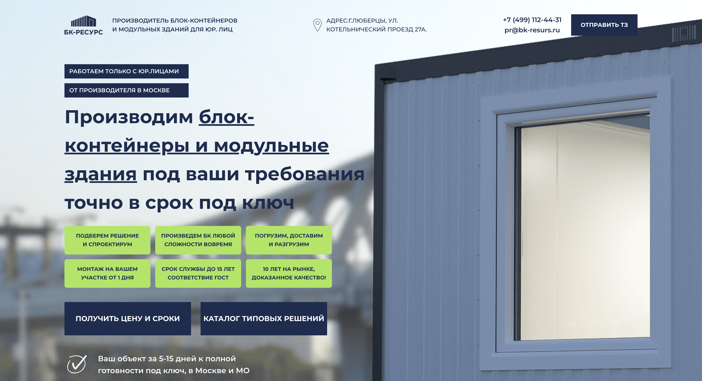

# Лендинг производителя блок-контейнеров

Учебный проект для практики в React.

> ⚠️ **Дисклеймер.** Это учебный проект. Он не является официальным сайтом компании «БК-РЕСУРС» и никак с ней не связан. Дизайн, структура и контент взяты с сайта компании исключительно как образец для вёрстки. Все права на тексты, изображения, логотипы, сертификаты и товарные знаки принадлежат их правообладателям. Проект не используется в коммерческих целях, а на опубликованной демо-версии формы не отправляют данные. Если вы правообладатель и хотите, чтобы проект был удалён, свяжитесь со мной tankievmi@bk.ru.

**Демо:** [открыть сайт](https://tankievmagomed.github.io/block-container-landing-page/)



Лендинг производителя блок-контейнеров и модульных зданий. Фронтенд на React (Create React App). При локальном запуске формы отправляют данные на небольшой бэкенд, который сохраняет их в файл.

## Что нужно установить заранее

- [Node.js](https://nodejs.org/) (вместе с ним ставится `npm`)

## Запуск фронтенда

В корне проекта:

```
npm install
npm start
```

Откроется сайт на `http://localhost:3000`.

## Запуск бэкенда

Бэкенд — отдельная программа, её нужно запускать **отдельно**, в другом терминале, пока фронтенд тоже работает.

В папке `server`:

```
cd server
npm install
node index.js
```

Сервер поднимется на `http://localhost:4000` и будет принимать данные из форм на сайте, сохраняя их в `server/submissions.json`.

## Важно

Чтобы формы на сайте реально сохраняли данные, должны быть запущены **обе** части одновременно — и фронтенд (`npm start`), и бэкенд (`node index.js`).

На GitHub Pages бэкенд не запускается: там работает только статическая часть сайта.
